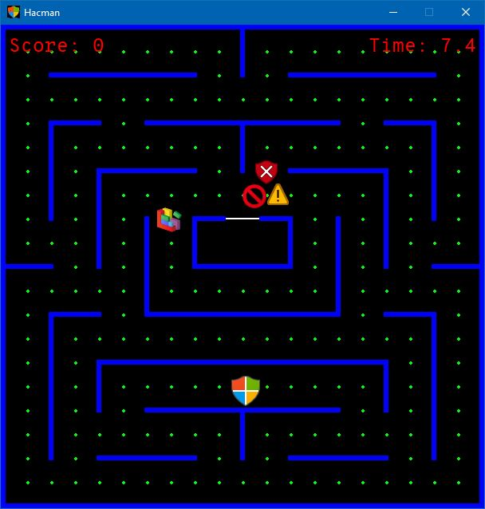

# Hacman

This is a simple game of Pacman created with PyGame forked from [hbokmann/Pacman](https://github.com/hbokmann/Pacman). We have modified this game to make it more Cyber Security themed by changing the icons and theme and added some features such as a scoreboard.

We are planning to run an instance of this game at the [Worcestershire Skills Show](http://www.worcestershire.gov.uk/careersportal/info/22/worcestershire_skills_show) in order to get some crowd interactivity at our stall.



## Usage

Install the project's dependencies:

```
pipenv install
```

Run the game:

```
python pacman.py
```
